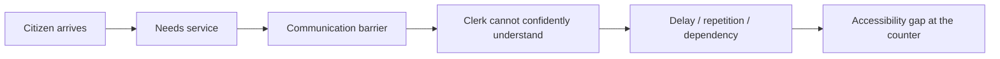
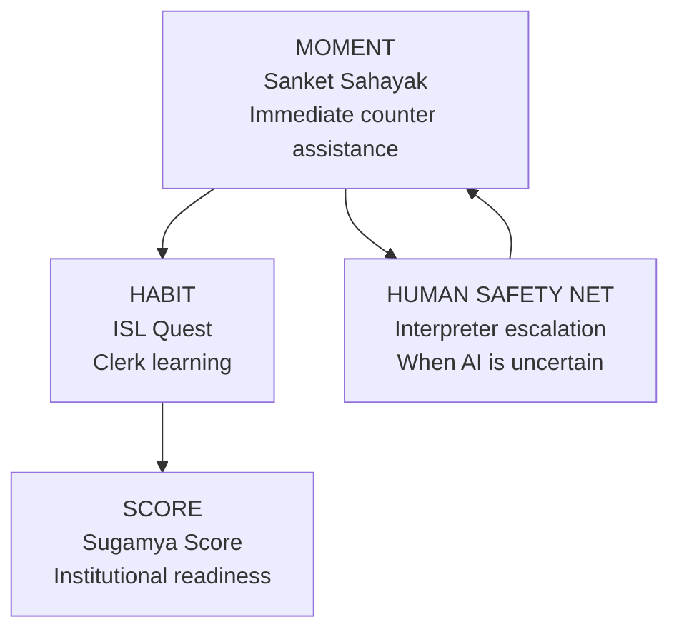
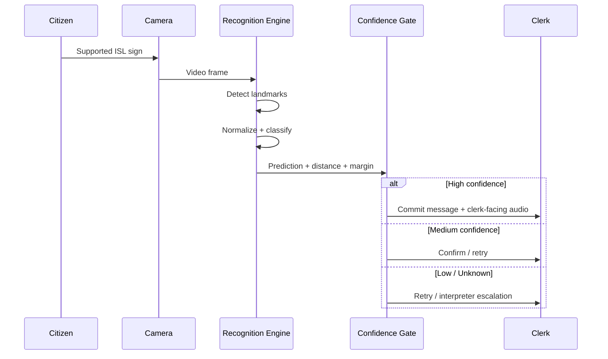
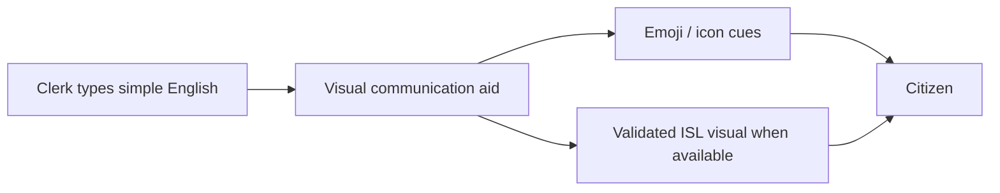
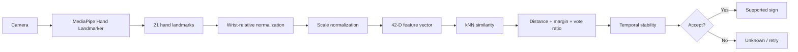
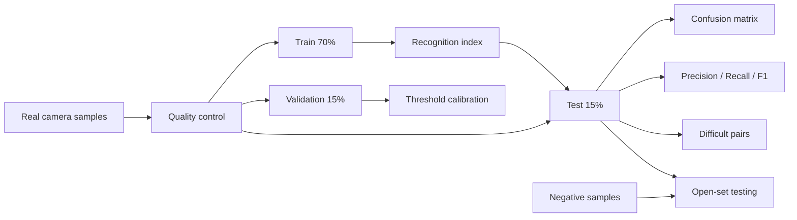
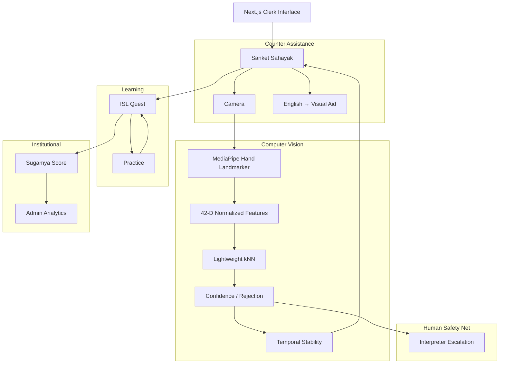
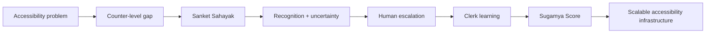

# ✦ SANKET 2.0

### **AI-assisted accessibility infrastructure for government service counters**

> **Technology when it can. Humans when it must.**

**SANKET** is a clerk-first accessibility platform designed to help government service counters communicate more effectively with citizens who use **Indian Sign Language (ISL)**.

It is **not positioned as a universal ISL translator**. Recognition is one component inside a larger workflow combining immediate counter assistance, clerk learning, institutional accessibility measurement, and human interpreter escalation.

[](#status)
[](#recognition-engine)
[](#research--evidence)
[](#license)

---

## 🧭 Table of Contents

- [At a Glance](#-at-a-glance)
- [The Problem](#-the-problem)
- [Our Approach](#-our-approach)
- [How SANKET Works](#-how-sanket-works)
- [Product Modules](#-product-modules)
- [Recognition Engine](#-recognition-engine)
- [Safety and Uncertainty](#-safety-and-uncertainty)
- [Clerk Communication](#-clerk-communication)
- [Dataset & Evaluation](#-dataset--evaluation)
- [Research & Evidence](#-research--evidence)
- [Architecture](#-architecture)
- [Technology Stack](#-technology-stack)
- [Quick Start](#-quick-start)
- [Recognition Lab](#-recognition-lab)
- [Project Structure](#-project-structure)
- [Security & Privacy](#-security--privacy)
- [Limitations](#-limitations)
- [Roadmap](#-roadmap)
- [National Demo](#-national-demo)
- [Team](#-team)
- [Documentation Map](#-documentation-map)
- [Status](#-status)
- [License](#-license)

---

## ⚡ At a Glance

| | SANKET |
|---|---|
| **Primary user** | Government clerk |
| **Citizen need** | Accessible communication through ISL |
| **Core interface** | Sanket Sahayak |
| **Recognition** | MediaPipe Hand Landmarker + normalized landmarks + lightweight kNN baseline |
| **Safety** | Confidence gates + rejection + temporal stability + interpreter escalation |
| **Learning** | ISL Quest |
| **Institutional layer** | Sugamya Score |
| **Data workflow** | Real-camera capture → train/validation/test → calibration → confusion analysis |
| **Mandatory paid AI API** | **No** |
| **Current status** | National-level prototype; field validation pending |

### The one-line idea

> **SANKET brings accessibility support to the government counter instead of asking the citizen to find it elsewhere.**

---

# 🧩 The Problem

At a public-service counter, communication has to work **at the moment the service is delivered**.

For an ISL-using citizen, a clerk who does not understand ISL can create friction even when the underlying government service is available.

The problem is therefore larger than translation:



### Root cause

Accessibility resources can exist outside the counter—courses, dictionaries, interpreter services and translation tools—while the operational need appears **inside the counter workflow**.

SANKET focuses on that missing layer.

---

# 💡 Our Approach

SANKET is built around four connected pillars:



### 1. MOMENT — Sanket Sahayak

Help the clerk handle the communication happening **right now**.

### 2. HABIT — ISL Quest

Turn repeated accessibility needs into opportunities for clerk learning.

### 3. SCORE — Sugamya Score

Create an institutional view of accessibility readiness.

### 4. HUMAN SAFETY NET

When automated recognition is uncertain, the system should **not pretend to know**.

---

# 🔄 How SANKET Works

## Citizen → Clerk



## Clerk → Citizen



**Important:** emoji are visual communication aids. They are **not ISL**.

---

# 🧱 Product Modules

| Module | Purpose | Primary user |
|---|---|---|
| **Sanket Sahayak** | Live counter communication assistance | Clerk |
| **ISL Quest** | Bite-sized ISL learning and practice | Clerk |
| **Sugamya Score** | Accessibility readiness / analytics | Institution/Admin |
| **Recognition Lab** | Dataset capture, evaluation and calibration | Developer/Researcher |
| **Interpreter Escalation** | Human fallback for uncertain cases | Clerk + interpreter |

---

# 🤖 Recognition Engine

The current prototype deliberately uses a lightweight, inspectable recognition baseline.

### Pipeline



### Why this architecture?

A lightweight baseline provides:

- browser-friendly inference;
- transparent similarity behavior;
- rapid iteration;
- easy real-camera data collection;
- measurable failure modes.

It is **not claimed to be the final production model**.

---

# 🛡️ Safety and Uncertainty

A nearest-neighbour classifier can always find a nearest class—even when the input is not a supported sign.

SANKET therefore uses multiple rejection signals:

- hand-quality gate;
- maximum distance;
- first-vs-second class margin;
- vote ratio;
- temporal consistency;
- explicit unknown/retry state.

### Current operational confidence bands

| State | Threshold | UI behavior |
|---|---:|---|
| **HIGH** | ≥ 0.82 | Eligible for automatic commit |
| **MEDIUM** | ≥ 0.62 | Confirm / retry |
| **LOW** | ≥ 0.45 | Retry / escalation |
| **UNKNOWN** | Below acceptance | Do not force a sign |

These values are **prototype operating thresholds**, not universal scientific probabilities.

---

# 🗣️ Clerk Communication

### Citizen → Clerk

The system can provide:

**ISL input → recognition → clerk-facing text → clerk-facing audio**

The audio channel is explicitly associated with the clerk-facing side.

### Clerk → Citizen

The clerk can enter basic English.

SANKET can produce simple visual cues, for example:

| Clerk message | Visual aid |
|---|---|
| Please wait a moment. | 🙏 ⏳ |
| Please show your document. | 👀 📋 |
| Please sign here. | ✍️ 👇 |
| Please enter your phone number. | 📱 🔢 |
| Please take a seat. | 🪑 |
| Your payment is received. | 💳 ✅ |
| I will call an interpreter. | 📞 🧑‍🏫 |

These are **visual aids**, not claims of official ISL translation.

---

# 📊 Dataset & Evaluation

The project includes a real-camera dataset and calibration workflow.

### Target

**20–50 samples/sign**

Recommended:

**30+ samples/sign**

The target is a practical prototype collection goal—not a guarantee of accuracy.

### Evaluation pipeline



### Metrics

The Recognition Lab can evaluate:

- accuracy;
- precision;
- recall;
- F1;
- macro-F1;
- confusion matrix;
- difficult sign pairs;
- rejection rate;
- open-set false acceptance where negative samples exist.

### Critical evaluation rule

> **Calibration uses validation data. The final test set must remain untouched during threshold tuning.**

This prevents test-set leakage.

---

# 🔬 Research & Evidence

SANKET includes a dedicated research/documentation layer under [`research/`](./research/).

### Research paper

- [`SANKET_RESEARCH_PAPER.md`](./research/SANKET_RESEARCH_PAPER.md)

### Detailed reports

- [`DETAILED_RESEARCH_REPORT.md`](./research/DETAILED_RESEARCH_REPORT.md)
- [`TECHNICAL_RESEARCH_REPORT.md`](./research/TECHNICAL_RESEARCH_REPORT.md)
- [`DATASET_EVALUATION_RESEARCH.md`](./research/DATASET_EVALUATION_RESEARCH.md)
- [`SYSTEM_DESIGN_SRS.md`](./research/SYSTEM_DESIGN_SRS.md)

### Literature & evidence

- [`LITERATURE_REVIEW_ISL.md`](./research/LITERATURE_REVIEW_ISL.md)
- [`RESEARCH_EVIDENCE_MATRIX.md`](./research/RESEARCH_EVIDENCE_MATRIX.md)
- [`REFERENCES.md`](./research/REFERENCES.md)
- [`REFERENCES.bib`](./research/REFERENCES.bib)

### Ethics & provenance

- [`ETHICS_PRIVACY_ACCESSIBILITY.md`](./research/ETHICS_PRIVACY_ACCESSIBILITY.md)
- [`DATA_PROVENANCE_LICENSE_MATRIX.md`](./research/DATA_PROVENANCE_LICENSE_MATRIX.md)

### Reproducibility

- [`VALIDATION_PROTOCOL.md`](./research/VALIDATION_PROTOCOL.md)

### OpenCode research integration

- [`OPENCODE_RESEARCH_INTEGRATION_TASK.md`](./research/OPENCODE_RESEARCH_INTEGRATION_TASK.md)

### Consolidated PDF

- [`SANKET_Research_Documentation_Pack.pdf`](./SANKET_Research_Documentation_Pack.pdf)

---

# 🏛️ Research Position

The project does **not** claim:

- universal ISL translation;
- production-grade field accuracy;
- government deployment;
- official ISLRTC endorsement;
- that emoji are ISL;
- that 20–50 samples/sign guarantee accuracy.

Instead, the research contribution is positioned around:

> **A counter-level accessibility workflow that combines constrained recognition, uncertainty handling, clerk communication, human escalation, learning and institutional readiness measurement.**

---

# 🏗️ Architecture



---

# 🧰 Technology Stack

| Layer | Technology |
|---|---|
| Framework | Next.js 14 + React |
| Language | TypeScript |
| Styling | Tailwind CSS |
| Computer Vision | MediaPipe Tasks Vision |
| Recognition | Normalized landmarks + kNN baseline |
| Charts | Recharts |
| Icons | Lucide / React Icons |
| Documents | jsPDF / repository documentation |
| Validation | TypeScript + Vitest infrastructure |
| Persistence | Local/browser storage where appropriate |
| Deployment target | Web |

> Next.js version is intentionally not upgraded as part of the recognition work because major framework upgrades can introduce unrelated demo risk.

---

# 🚀 Quick Start

## Requirements

- Node.js
- npm
- modern browser with camera support

## Install

```bash
npm install
```

## Development

```bash
npm run dev
```

Then open the local development URL shown by Next.js.

## Type check

```bash
npm run typecheck
```

## Tests

```bash
npm test
```

## Production build

```bash
npm run build
```

## Recognition diagnostics

```bash
npm run evaluate:recognition
```

## Dataset conversion

```bash
npm run datasets:convert
```

---

# 🧪 Recognition Lab

Open:

```text
/recognition-lab
```

The Recognition Lab is a **developer/research tool**, not the normal citizen/clerk workflow.

It supports:

- sign selection;
- real-camera capture;
- 20–50 sample target;
- negative sample capture;
- dataset export;
- landmark import;
- train/validation/test evaluation;
- confusion matrix;
- difficult-pair analysis;
- threshold calibration;
- open-set diagnostics;
- calibration persistence.

### External data

The repository contains source documentation and import tooling.

Raw third-party datasets are **not automatically bundled** merely because they are downloadable.

Before integration:

1. verify license;
2. verify label mapping;
3. preserve provenance;
4. document transformations;
5. avoid unsupported claims.

---

# 📁 Project Structure

```text
.
├── src/
│   ├── app/
│   │   ├── (clerk)/
│   │   ├── (national)/
│   │   ├── (auth)/
│   │   └── recognition-lab/
│   ├── features/
│   ├── lib/
│   │   └── recognition/
│   ├── data/
│   └── types/
│
├── datasets/
│   ├── SOURCES.md
│   └── manifest.json
│
├── scripts/
│   ├── evaluate-recognition.ts
│   ├── convert-landmarks.ts
│   └── download-isl-datasets.sh
│
├── research/
│   ├── SANKET_RESEARCH_PAPER.md
│   ├── DETAILED_RESEARCH_REPORT.md
│   ├── LITERATURE_REVIEW_ISL.md
│   ├── TECHNICAL_RESEARCH_REPORT.md
│   ├── DATASET_EVALUATION_RESEARCH.md
│   ├── SYSTEM_DESIGN_SRS.md
│   ├── ETHICS_PRIVACY_ACCESSIBILITY.md
│   ├── DATA_PROVENANCE_LICENSE_MATRIX.md
│   ├── RESEARCH_EVIDENCE_MATRIX.md
│   ├── VALIDATION_PROTOCOL.md
│   ├── VIVA_AND_JUDGE_RESEARCH_QA.md
│   ├── REFERENCES.md
│   ├── REFERENCES.bib
│   └── OPENCODE_RESEARCH_INTEGRATION_TASK.md
│
├── OPENCODE_MASTER_TASK.md
├── REAL_CAMERA_DATASET_GUIDE.md
├── NATIONAL_READINESS.md
├── NATIONAL_DEMO_RUNBOOK.md
└── NATIONAL_JUDGE_AUDIT.md
```

---

# 🔐 Security & Privacy

SANKET is designed with a clerk-first protected workflow.

Key principles:

- protected application routes;
- server-side authentication verification;
- secure production cookies;
- no unnecessary mandatory paid AI dependency;
- camera data minimization;
- explicit dataset capture workflow;
- provenance tracking;
- human escalation for uncertain communication.

### Dataset privacy

Real-camera data should be collected only with appropriate consent and a documented retention/deletion policy.

Do not collect or retain personal data that is not required for the stated purpose.

---

# ⚠️ Limitations

SANKET is a **national-level prototype**, not a completed production deployment.

Current limitations include:

1. The recognition vocabulary is constrained.
2. Real-camera dataset coverage must continue to expand.
3. Signer diversity must be validated.
4. Lighting/device/background variation requires broader testing.
5. Static 42-D frame recognition does not solve dynamic ISL.
6. ISL sign mappings and prototype visual assets require appropriate expert validation.
7. Interpreter transport may remain prototype-level.
8. Field accuracy has not been established unless an explicit field evaluation is documented.
9. External datasets have different licenses and task definitions.
10. Government deployment and impact claims require real-world evidence.

---

# 🗺️ Roadmap

## Phase 1 — Prototype

- [x] Clerk-first Sahayak workflow
- [x] Camera integration
- [x] Lightweight recognition baseline
- [x] Confidence/rejection logic
- [x] Recognition Lab
- [x] Real-camera dataset workflow
- [x] Calibration/evaluation tooling
- [x] Research documentation

## Phase 2 — Validation

- [ ] 20–50 real samples for every supported sign
- [ ] Multi-signer capture
- [ ] Signer-aware evaluation
- [ ] Expert ISL review
- [ ] Larger negative dataset
- [ ] Device/lighting robustness testing

## Phase 3 — Advanced Recognition

- [ ] Dynamic sequence recognition
- [ ] Temporal model
- [ ] Larger validated vocabulary
- [ ] More robust cross-device calibration
- [ ] Continuous-sentence research

## Phase 4 — Field Pilot

- [ ] Accessibility stakeholder involvement
- [ ] Government-counter pilot
- [ ] Privacy/consent governance
- [ ] Interpreter workflow integration
- [ ] Real service-completion evaluation

---

# 🎬 National Demo

Recommended judge story:



### Demo principle

Do not demonstrate only the “happy path.”

Show that the system can:

1. recognize a supported sign;
2. communicate it to the clerk;
3. handle uncertainty;
4. provide a visual clerk response;
5. escalate when AI should not guess.

### Judge-ready statement

> **“Our innovation is not claiming that AI can understand every sign. Our innovation is designing the counter workflow so that AI helps when it is confident, asks for confirmation when it is uncertain, and brings a human into the loop when it must.”**

---

# 👥 Team

### Team BeyondWords

**Yuva 6.0 — National-Level Prototype**

| Role | Member |
|---|---|
| Team Leader | **Pratiksha Jawale** |
| Developer | **Rudra Keyur Khaire** |
| Research | **Mahi Panchal** |
| Research | **Suhani Pawar** |
| Research | **Sheena Sharma** |

> Team roles should be kept synchronized with the official competition submission.

---

# 📚 Documentation Map

| Need | Document |
|---|---|
| Understand the project | `README.md` |
| OpenCode implementation | `OPENCODE_MASTER_TASK.md` |
| Dataset capture | `REAL_CAMERA_DATASET_GUIDE.md` |
| Research paper | `research/SANKET_RESEARCH_PAPER.md` |
| Detailed research | `research/DETAILED_RESEARCH_REPORT.md` |
| Literature review | `research/LITERATURE_REVIEW_ISL.md` |
| Technical research | `research/TECHNICAL_RESEARCH_REPORT.md` |
| Evaluation methodology | `research/DATASET_EVALUATION_RESEARCH.md` |
| System requirements | `research/SYSTEM_DESIGN_SRS.md` |
| Ethics/privacy | `research/ETHICS_PRIVACY_ACCESSIBILITY.md` |
| Dataset provenance | `research/DATA_PROVENANCE_LICENSE_MATRIX.md` |
| Evidence matrix | `research/RESEARCH_EVIDENCE_MATRIX.md` |
| Validation protocol | `research/VALIDATION_PROTOCOL.md` |
| Judge questions | `research/VIVA_AND_JUDGE_RESEARCH_QA.md` |
| National demo | `NATIONAL_DEMO_RUNBOOK.md` |
| National readiness | `NATIONAL_READINESS.md` |
| Judge audit | `NATIONAL_JUDGE_AUDIT.md` |
| Research PDF | `SANKET_Research_Documentation_Pack.pdf` |

---

# 📌 Status

### **National-Level Prototype — Validation in Progress**

SANKET is being developed for national-level presentation as an accessibility infrastructure prototype.

### What is established

- clerk-first product architecture;
- camera-assisted recognition workflow;
- uncertainty/rejection design;
- local English-to-visual-aid conversion;
- dataset/evaluation tooling;
- research/documentation layer.

### What still requires evidence

- broad real-camera recognition performance;
- signer-independent generalization;
- dynamic-sign recognition;
- expert validation of sign assets/mappings;
- field deployment;
- real-world service-impact measurement.

**Evidence before claims.**

---

# 📖 License

See the repository's license and individual dataset/source terms.

Third-party datasets, dictionary resources, visual assets and research materials may have separate licenses or usage conditions.

Do not redistribute external material without checking its applicable terms.

---

# 🙏 Acknowledgement

SANKET's research and design work draws on the broader Indian Sign Language ecosystem, including resources from the **Indian Sign Language Research and Training Centre (ISLRTC), Department of Empowerment of Persons with Disabilities, Ministry of Social Justice and Empowerment, Government of India**, as well as scholarly ISL recognition and translation research.

Acknowledgement does **not** imply government endorsement, certification or deployment.

---

## Built by Team BeyondWords

**SANKET 2.0**

> **From communication barriers at the counter → to measurable accessibility infrastructure.**
